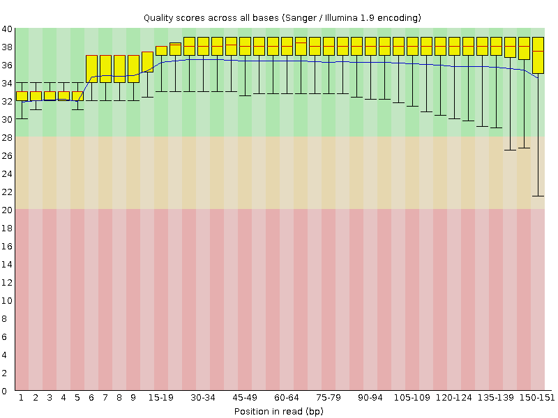
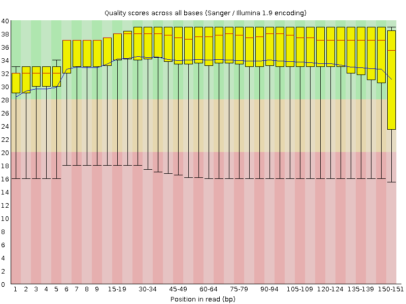
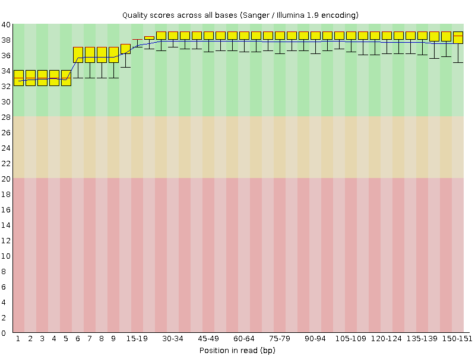
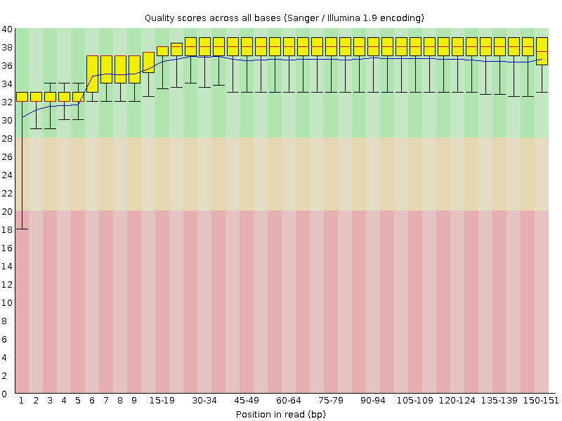
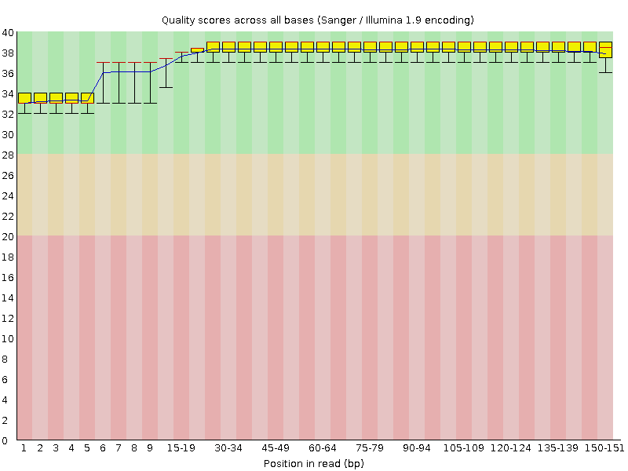
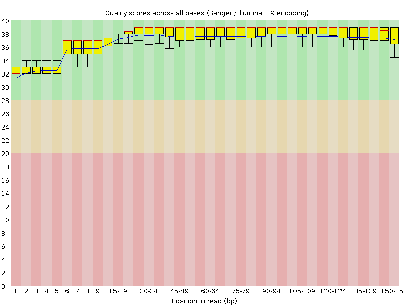

```{r Configurations and Librarys, echo=FALSE, message=FALSE, warning=FALSE}
# For the entire markdown document, Show only the code output, not the code itself.
knitr::opts_chunk$set(echo=FALSE, message=FALSE, warning=FALSE)
                      
# This package contains the 'gap.barplot' class we will use
library(plotrix)

# This package contains the 'IRanges', 'GRanges' and 'GRangesList' classes we will use
library(GenomicRanges)

# Loading the RSamtools library
library(Rsamtools)

# This package contains the 'arrgange' class we will use
library(dplyr)

# Loading the knitr library to get some nice looking tables
library(knitr)

# Tell R not to complain...
options(stringsAsFactors = FALSE)

# Enable the garbage collector (disabling not recommended)
GarbageCollection = TRUE

```


<h2>Introduction</h2>

Cardiomyopathy is a heart disease that is, as with many other diseases, a combination of factors, such as genetic mutation(s). 
Cardiomyopathy comes in roughly 4 forms (UMCG) :
*	Hypertrophic cardiomyopathy: A portion of the heart thickens and becomes harder and less flexible. 
*	Dilated cardiomyopathy: The heart becomes severely enlarged, pumping of the blood is less efficient. 
*	Restrictive cardiomyopathy: The heart’s tissue is getting replaced by connective tissue. 
*	Arrhythmogenic right ventricular cardiomyopathy: The heart’s muscle cells from the right ventricular are replaced by connective tissue or fat. 


The human genetics department of the UMCG investigates not only the regular data sources as a physical exam or an EKG, but also the genome of the patient. When comparing the patients genome to a gene panel with genes that are known to be involved in cardiomyopathy. 
One of these genes is TTN, a large gene with many exons. This gene is known to encode for a large abundant protein of striated muscle. It is also known that variants in this gene can be associated with various forms of cardiomyopathy. 


<h2>Chapter 1 - Galaxy Introduction</h2>

A quick look around the Galaxy database


<h2>Chapter 2 - Data Introduction</h2>

<h3>Assignment 1 - FastQ Format</h3>
The patient data (patient 2) came from Next Generation Sequencing. Most often this data is represented in a FastQ file. In this file ASCII codes are given. These codes can be used to determine the quality of the given data. 
Every sequenced base is assigned a code that matches one specific value. Each of these values lead to a differet accuracy level. 
To understand this process the first 10 bases from a data set are analysed using the ASCII codes in assignment 1. 
A data point is said to have a proper quality if the base call accuracy is equal or higher than 99.9, meaning the numerical score has to be at least 30.
The ASCII codes are used to be able to determine whether or not the data is reliable. Using the ASCII values an accuracy percentage can be calculated. 
The results of the analysis can be seen in the table below.


```{r FASTQ ASCII Quality calculator}
Base = c("N","T","C","A","T","G","T","A","C","G") #Bases as given
Quality_CHAR = c("#",">",">","1","A","1","B","3","B","1") #Qualitiy CHAR as given
Quality_STRING = paste0("#",">",">","1","A","1","B","3","B","1") #The Qualitiy CHAR stored differend
ASCII = utf8ToInt(Quality_STRING) #Converting the Quality string to ASCII-values
Numerical_Score = ASCII-33 #Subtracting 33 from the ASCII-values as per standard for Illumina
Base_call_accuracy = round(1-(10**((-Numerical_Score)/10)), digits = 4) #Calculating Phred quality score and rounding it to 4 digits

#PS. Yeah I know I just made the assignmet harder for myself...
```

|               Base | `r Base[1]`               | `r Base[2]`               | `r Base[3]`               | `r Base[4]`               | `r Base[5]`               | `r Base[6]`               | `r Base[7]`               | `r Base[8]`               | `r Base[9]`               | `r Base[10]`               |
|-------------------:|---------------------------|---------------------------|---------------------------|---------------------------|---------------------------|---------------------------|---------------------------|---------------------------|---------------------------|----------------------------|
|       Quality Char | `r Quality_CHAR[1]`       | `r Quality_CHAR[2]`       | `r Quality_CHAR[3]`       | `r Quality_CHAR[4]`       | `r Quality_CHAR[5]`       | `r Quality_CHAR[6]`       | `r Quality_CHAR[7]`       | `r Quality_CHAR[8]`       | `r Quality_CHAR[9]`       | `r Quality_CHAR[10]`       |
|   Nummerical Score | `r Numerical_Score[1]`    | `r Numerical_Score[2]`    | `r Numerical_Score[3]`    | `r Numerical_Score[4]`    | `r Numerical_Score[5]`    | `r Numerical_Score[6]`    | `r Numerical_Score[7]`    | `r Numerical_Score[8]`    | `r Numerical_Score[9]`    | `r Numerical_Score[10]`    |
| Base call accuracy | `r Base_call_accuracy[1]` | `r Base_call_accuracy[2]` | `r Base_call_accuracy[3]` | `r Base_call_accuracy[4]` | `r Base_call_accuracy[5]` | `r Base_call_accuracy[6]` | `r Base_call_accuracy[7]` | `r Base_call_accuracy[8]` | `r Base_call_accuracy[9]` | `r Base_call_accuracy[10]` |

From this table one can draw some conclusions.
Four of the 10 basesare shown to be of an acceptable accuracy, the remaining six do not follow the requirements. Due to this fact the data set should not be used for further analysis as it is, since the quality of the set is not as accurate as supposed to. 


<h2>Chapter 3 - Quality Control</h2> 

The data of patient 2 was loaded from the shared Galaxy library to the own history. 
This data can now be analysed on the quality. Once the quality is sufficient, the data can be used to go along with the project. 
This quality control can be done using the FastQC tool from Galaxy. 

Settings of the FastQC tool:

- Multiple Datasets: Select both patient samples (R1 and R2)
- All other settings remain untouched

The FastQC tool gives back a visualization of the analysed data. 

<h3>Assignment 2 - Read Quality.</h3>
Using the visualization returned from the tool and the given information above the image, one can determine the quality of the data. 
In the figures below the quality of both R1 and R2 are shown.






Both the R1 and the R2 strand show areas with fluctiation. R1 shows less accurate results at the end of the reads. Although this is as expected with Illumina sequecing, the value drops below the acceptable point. 
R2 however shows very low accuracies over the entire sequence. 

To be able to work with the data the data will be tweaked. Using various options of the Trimmomatic tool from Galaxy an attempt has been made to make the data workable. 
Two aspects were used to tweak the data: The minimum quality and the minimum read length. 
The reason these two aspects are tweaked with is the following:

* Minimum quality: The quality needs to be altered to obtain results. Quality values below a certain range are not accurate enough, since a large part of the sequenced data will be assigned wrong base. 
* Minimum read length: One does not want to many short reads, since they can interfere with the longer reads and cause various misinterpretations of the data. 

<h3>Assignment 3 - Read Trimming</h3>
To be able to work with the data such that the overall quality is approximately 30. 
This can be done by trimming the data using the Trimmomatic tool from Galaxy. 
The settings are as follows:

* Paired end data: Yes
* Input type: R1 and R2 files from the patient
* Perform initial IlluminaCLIP: Yes
* Adapter sequence to use: TruSeq3 (paired-ended, for miSeq and HiSeq)
* Trimmomatic operation to perform: Sliding window trimming. 
  * Number of bases to average across: 4
  * Average quality required: Variable (20 minimal)
* Trimmomatic operation to perform: Drop reads below a specified length (MINLEN)
  * Minimum length of reads to be kept: Variable

  
In the table below various attempts to obtain the most suitable results are shown. In the figures below images can be seen from some of these attempts. 


|Attempt | Number of sequences | Minimum quality | Minimum read length | Sequences lost from initial value|Coverage| Conclusion |  
| --- | ---| --- | --- | --- | --- | --- |
|1 | 1,298,979 | N/A | N/A | N/A | 1218 | Initial data set |
|2 | 910,105 | 20 | 70 | 388,874 | 853 | First trimming step. First bp shows very low quality (18) | 
|3 | 644,445 | 26 | 70 | 654,534 | 604 | All positions above 30 quality score  | 
|4 | 899692 | 20 | 75 | 399287 | 843 | No variation from the second attempt  | 
|5 | 852698 | 20 | 100  | 446281 | 799 | Hardly any variation of the fastQC plot in comparison to the second attempt  | 
|6 | 1072839 | 20 | 20 |  226140 | 1006  | The overall mean quality is lower than the mean value at attempt 2 | 
|7 | 448598 | 30  | 70 |  | 421 |  All qualities at least 32 | 


To continue the project the settings of minimum quality = 26 and minimum read length = 70 are used. 
This is so all the positions show proper quality scores, since all are in the green range. 











<h2>Chapter 4 - Read Mapping</h2>

An average coverage of 30 is aimed for, to give more certainty about whether or not a varying nucleaotide is a true variant or simply a sequencing error. 


<h3>Assignment 4 - Mapping quality</h3>
To determine the quality of the data the coverage has to be determined. This can be done using the Lander/Waterman equation below. 

$C=\frac{LN}{G}$

Where:

* C = Coverage
* L = Read Length
* N = Number of Reads
* G = Captured Region

If: C= 20, N = 25 million and L = 300, G can be calculated as follows:

$G=\frac{LN}{C}=\frac{300*25,000,000}{20}=3.75*e^{6}$

With this captured data the coverage over the data can be analysed. The coverage is added to the table above. 


<h3>Assignment 5 - Visualizing the Mapping Data</h3>
The data will be mapped using the BWA-MEM tool from Galaxy.
The settings for the BWA-MEM tool are:

* Using reference genome: Human reference HG19
* Single or Paired-end reads: Paired 
* Select the Trimmomatic results with the appropriate settings. 

By creating the reads, duplicates can arise, which do not origin from the sample, but are technical. These duplicates can possibly generate false positive variants. This is the case since one sample will technically be used twice. If this original read contained a variant, this variant will be read twice and hence increasing the change it will be interpreted as an actual variant, even if this was not the case in the original data. 


Using the MarkDuplicates tool from Galaxy the duplicate mapped reads are mapped. 
The settings for the MarkDuplicates tool are:

* Select SAM/BAM dataset or dataset collection: Map with BWA-MEM.... (Results from the BWA-MEM tool)
* Assume the input is already sorted: No

This tool flags the duplicate but will not remove the read from the data. Other tools however will ignore any reads that contain such a flag. 

The actual visualization of the data is done using the Integrated Genome Viewer (IGV). For this the dataset and bam_indez files are downloaded from the MarkDuplicates output. 

The .bam file is loaded into IGV. To make it easier to find the mapped regions a reference genome. 
This reference genome can be found on Galaxy (Shared Data -> Data Libraries -> Cardio Panel -> CAR_0394321_+en-20_target_v2.BED). This .bed file can then be loaded into IGV as well. 

Using the reference the gene LAMA4 is investigated on variants. When zooming in on the gene and exons in particular variants can be found. Below are three different variants that were encountered. 

chr6:112,508,770 causes a change in amino acid. From A to V. In the gene of LAMA4.
chr6:112,435,273 had no effect, since it is a mutation outside of the exon. A mutation from A to C. 
chr6:112,435,912 was within the exon, but had no influence of the coded amino acid. A to T. 


Why are some reads outside of the location?
  The primer does not necesarrily bind at the exact position, causing that regions outside of the desired locations get multiplied as well. 
  
Unfortunately no images are available for this part of the experiment, as IGV can only be accessed on the Hanze Linux computer. Due to the Coronavirus it was impossible for us to obtain a graphic of these mutations. 


<h2>Chapter 5 - PileUP</h2>

From this point on the assignment numbers start over from number 1 again. 


Using the MPileUp program from Galaxy all the data from the mapped reads is piled in one big file. 
The settings of MPileUp are:

* Choose the source for the reference genome: Use a built in genome
* BAM files: Select the BAM output from MarkDuplicates
* Using reference genome: Human reference HG19
* Genotype Likelihood Computation: Do not perform genotype likelihood computation (output pileup)
* Output base positions on reads: No
* Output mapping quality: No
* Advanced options: Basic

This large file shows the difference with respect to the reference genome. This file is too large to manually analyse all lines. Therefore the experiment will continue using R. 

<h3>Assignment 1 - Loading the BED-data</h3>
This step returns the exon locations for the paneled genes. 

```{r Assignment 5.1; Loading the BED-data}
# Import the bedfile, generated in Galaxy
bedfile = read.table("./data/Galaxy65-[CAR_0394321__en-20_target_v2.BED.txt].bed")

# Rename the colums of the bedfile
names = list("V1"="Chromosome",
             "V2"="Start",
             "V3"="End",
             "V4"="Gene_name")
names(bedfile) = names

# Make a crosstable where you select row Chromosome from the bedfile
exons_per_chromosome = table(bedfile["Chromosome"])

# Make a barplot from the crosstable
barplot(exons_per_chromosome,
        main="Number of exones per chromosome",
        xlab="Chromosome",
        ylab="Number of exons",
        las=2 #Rotate x-axis value's 90°
)

# Garbage collection
if(GarbageCollection == TRUE){
    remove(ASCII)
    remove(Base)
    remove(Base_call_accuracy)
    remove(Numerical_Score)
    remove(Quality_CHAR)
    remove(Quality_STRING)
    remove(names)
    remove(exons_per_chromosome)
}

```

<h3>Assignment 2 - BED-visualization</h3>
The goal of this assignment was to visualize the number of genes per chromosome. 

```{r Assignment 5.2; BED-visualization}
# Select row Chomosome and Gene name from the bedfile.
genes_and_chromosomes = bedfile[c("Chromosome","Gene_name")]

# Count the nummer of occurence of each duplicate of each gene.
gen_name_per_chromosome = unique(genes_and_chromosomes)

# Make a crosstable of the Chomosome, thereby counting the number of genes per chromosome
gene_per_chromome = table(gen_name_per_chromosome["Chromosome"])

# Make a barplot from the crosstable
barplot(gene_per_chromome,
        main = "Number of sequenced genes per chromosome",
        xlab = "Chromosome",
        ylab = "Number of genes",
        las = 2 #Rotate x-axis value's 90°
)

# Garbage collection
if(GarbageCollection == TRUE){
    remove(genes_and_chromosomes)
    remove(gen_name_per_chromosome)
    remove(gene_per_chromome)
}

```

<h3>Assignment 3 - Bioconductor</h3>
The data is analyzed using, among others, the GenomicRanges objects from the Bioconductor package. 
In the chunk below the Bioconductor package is installed. 

```{r Assignment 5.3; Bioconductor}
# Make an empty list for the GRanges for-loop
gRanges_list = list()

# Make a list containing all gene names
gene_names = unique(bedfile$Gene_name)

# Make a for-loop containing all gene-names
for(gene in gene_names) {
    
    selected_gene = bedfile[bedfile$Gene_name == gene, ]
    
    # Create IRanges
    iRanges = IRanges(start = selected_gene$Start,
                      end = selected_gene$End,
                      names = selected_gene$Gene_name)

    # Converts IRanges in to GRanges where the seqname is 'chr' + chromosomenumber
    gRanges = GRanges(seqnames = paste0("chr", selected_gene$Chromosome),
                      ranges = iRanges)
  
    # Add the GRanges to a list, labeled with the genename
    gRanges_list[[gene]] = gRanges
}

# Re-Save the gRanges list as an 'official' gRanges list
gRanges_list = GRangesList(gRanges_list)

# Check to see if the data types and length are correct
cat("Object class type should be 'CompressedGRangesList':", class(gRanges_list), "\n")
cat("Contents of the object should be of type 'GRanges':", elementType(gRanges_list), "\n")
cat("Number of elements in the list should be '55':", length(gRanges_list), "\n")

# Check the length (in basepairs) of a single gene
psen2_ranges <- ranges(gRanges_list[['PSEN2']])
cat("Length of the 'PSEN2' gene should be '1747':", sum(width(psen2_ranges)), "\n")

# Garbage collection
if(GarbageCollection == TRUE){
    remove(gene)
    remove(selected_gene)
    remove(iRanges)
    remove(gRanges)
    remove(psen2_ranges)
    remove(bedfile)
}

```

<h3>Assignment 4 - Gene Lengths</h3>
This assignment is to show the length of all the various genes

```{r Assignment 5.4; Gene Lengths}
# Calculate the total lenght of every gene
genelenght = sum(width(gRanges_list))

# Show the total lenght of every gene in a barplot with gap
gap.barplot(genelenght,
            gap = c(20000,100000), #Create a gap/cutout on the y-axis between 20.000 and 100.000
            xlab="", #Purposefully remove the x-axis label to make the values readable
            ylab="Gene lenght (bp)",
            xaxlab = gene_names, #Define the values of the x-axis
            las=2, #Rotate x-axis value's 90°
            main="Sequenced gene lenght"
)

# Garbage collection
if(GarbageCollection == TRUE){
    remove(genelenght)
}

```

<h3>Assignment 5 - PileUp loading</h3>

```{r Assignment 5.5; Pileup Loading}
# Load the pileup data, generated in Galaxy
Bamfile_pileup = BamFile("./data/Galaxy17-[MarkDuplicates_on_data_15__MarkDuplicates_BAM_output].bam", index =  "./data/Galaxy17-[MarkDuplicates_on_data_15__MarkDuplicates_BAM_output].bai")

# Select a single gene as a test
NEXN = gRanges_list$NEXN

# Make a ScanBamParam object based on the selected gene
NEXNscanParam = ScanBamParam(what = scanBamWhat(), which = NEXN)

# Make pileup with the ScanBamParam and the loaded Bampileup file
NEXNpileup = pileup(file = Bamfile_pileup, scanBamParam = NEXNscanParam)

# Show the first 5 rows of the pileup
kable(head(NEXNpileup, n=5), caption = "NEXN, manually selected")

# Garbage collection
if(GarbageCollection == TRUE){
    remove(NEXN)
    remove(NEXNscanParam)
    remove(NEXNpileup)
}

```

<h3>Assignment 6 - PileUp Processing</h3>
While assignment 5 focused on just one single gene, this assignment all data will be gathered into one object. 
This will be done similarly to assignment 5.

```{r Assignment 5.6; Pileup Processing}
# Make an empty list for the pileup for-loop
pileup_list = list()

# Make a for-loop based on all gene-names
for(gene in gene_names){
    # Select a gene from the GRanges list
    GeneSelection = gRanges_list[[gene]]
    
    # Make a ScanBamParam object based on the selected gene
    GeneParam = ScanBamParam(what = scanBamWhat(), which = GeneSelection)
    
    # Make a pileup with the ScanBamParam and the loaded Bampileup file and add it to the list
    pileup_list[[gene]] = pileup(file = Bamfile_pileup, scanBamParam = GeneParam)
}

# Show the first 5 rows of NEXN's pileup to compare with Assignment 5.5
kable(head(pileup_list[["NEXN"]], n=5), caption = "NEXN from the for-loop")

# Garbage collection
if(GarbageCollection == TRUE){
    remove(gene)
    remove(GeneSelection)
    remove(GeneParam)
    remove(Bamfile_pileup)
}

```

One single list now contains all the needed values. 


<h3>Assignment 7 - Coverage calculation and reporting</h3>

```{r Assignment 5.7; Coverage calculation and reporting}
# Create empty data-frame, but specify columns and data types
df_genes = data.frame(genename=character(),
                      sequencedbases=numeric(),
                      averagecoverage=numeric(),
                      lowcoveragecount=numeric(),
                      lowcoveragepercentage=numeric()
                      )

# Make a for-loop based on all gene-names
for(gene in gene_names){
    # Calculate coverage
    coverage = aggregate(x = list(count=pileup_list[[gene]]$count), 
                         by = list(pos=pileup_list[[gene]]$pos),
                         FUN=sum)
    
    # Calculate the average coverage
    averagecoverage=colMeans(coverage["count"])
    
    # Calculate the total number of positions based on the number of rows (1 row = 1 position)
    total_positions = nrow(coverage)
    
    # Select all positions with <30 reads
    lowcoverage_select = subset(coverage, subset = `count` < 30)
    
    # Count the number of positions with <30 reads (1 row = 1 position)
    lowcoverage_positions = nrow(lowcoverage_select)
    
    # Divide 'number of low read positions' by the 'total number of positions' to calculate the %
    lowcoverage_percent = lowcoverage_positions/total_positions
    
    # Add everything to a DF row
    new_row = list(genename=gene,
                   sequencedbases=total_positions,
                   averagecoverage=averagecoverage,
                   lowcoveragecount=lowcoverage_positions,
                   lowcoveragepercentage=lowcoverage_percent)
    df_genes <- rbind(df_genes, new_row)
    
}

# Sort the df_genes file from highest to lowest lowcoverage%
df_genes = arrange(df_genes, desc(lowcoveragepercentage))

# Make a CSV-file as requested by the instructor (code usualy disabled)
#write.csv(df_genes,"hoofdstuk5.csv", row.names = TRUE)

# Show the information for every gene
kable(df_genes, caption = "Coveragedata per gene")

# Garbage collection
if(GarbageCollection == TRUE){
    remove(gene)
    remove(coverage)
    remove(averagecoverage)
    remove(total_positions)
    remove(lowcoverage_select)
    remove(lowcoverage_positions)
    remove(lowcoverage_percent)
    remove(new_row)
    remove(pileup_list)
    remove(df_genes)
}

```


<h2>Chapter 6 - Varscan</h2>

To find actual variants from the PileUp file the Varscan2 tool from Galaxy is used. 
The settings are all left at the default settings. 

The varscan yields a .vcf file worth analysing. 
The first 23 lines are headers, without any actual data on the patient. 

<h3>Assignment 8 - VCF File Processing</h3>
The aim of this experiment was to test where the VarScan overlapped with the earlier made Genomic ranges and filter out all the variants where the frequency was less than 30%. This was stored into a new VCF file


```{r Assignment 6.8; VCF File Processing}
# Read the .vcf file, generated in Galaxy
varscan = read.delim("./data/Galaxy67-[VarScan_on_data_66].vcf",
                     header = TRUE,
                     sep = "\t", #Separate using tab
                     skip = 23 #Skip the first 23 lines (header)
)

# Split the data row
splitted_data = strsplit(varscan$Sample1, ":")

# Show the splitted data (for debugging puposes only)
#do.call(rbind, splitted_data)

# Select the 7th row, remove the %, convert to numeric and store.
varscan_percent = as.numeric(gsub(pattern = "%", replacement = "", lapply(splitted_data, `[[`, 7)))


# Make a GRange
iRanges = IRanges(start = varscan$POS, end = varscan$POS)
gRanges = GRanges(seqnames = varscan$X.CHROM, ranges = iRanges)

# Bind varscan_percent to the 'GRanges' object
mcols(gRanges) <- DataFrame(Freq=varscan_percent)

# Look where the positions 
overlap = as.data.frame(findOverlaps(gRanges_list, gRanges))


# Filter everything without overlap and Freq < 30
selected_lines = overlap$subjectHits[gRanges[overlap$subjectHits]$Freq > 30]

# Add 24 to the selected lines (to compensate for the header)
true_selection = selected_lines + 24

# Read the VCF file from galaxy
vcf_raw = readLines(con = "./data/Galaxy67-[VarScan_on_data_66].vcf")

# Make a new file file and write the first 24 lines (the header) to a new VCF file
write(vcf_raw[1:24],file="./output/code_made_by_bas.vcf")

# Add the selected lines to a file
write(vcf_raw[true_selection], file="./output/code_made_by_bas.vcf", append=TRUE)

# Garbage collection
if(GarbageCollection == TRUE){
    remove(varscan)
    remove(varscan_percent)
    remove(splitted_data)
    remove(iRanges)
    remove(gRanges_list)
    remove(true_selection)
    remove(vcf_raw)
}

```

Assignment 9 - Variant Visualization - Allele frequency
The allele frequency is portrayed using a histogram

```{r Assignment 6.9; Variant Visualization}
# Make a histogram to show how often each allele frequency occur
hist(gRanges[selected_lines,]$Freq,
     xlab = "Variant allele frequency (%)",
     ylab = "Occurrence",
     main = "Occurrence of every allele frequency",
     breaks = 20
)

# assignment continues after text
```

The peaks at 50 and 100% represent the fact whether a gene has homozygous loci (100%) or heterozygoes loci (50%)
PMID: 27144058

```{r Assignment 6.9 (continued)}


# Store the queryHits as a dataframe
df_hist = data.frame(table(overlap$queryHits))

# Name the first column Index and the second column Frequency
names_df_hist = list("V1" = "Index", "V2" = "Frequency")
names(df_hist) = names_df_hist

# Make a dataframe with the gene names indexed with a number
df_names=data.frame(1:55, gene_names)

# Name the first column Index and the second column Name
names_df_names = list("V1" = "Index", "V2" = "Name")
names(df_names) = names_df_names

# Merge df_names and df_hist, where df_hist$Index == df_names$Index, merge only if gene exist in df_hist
df_merged = merge(x = df_names, y = df_hist, by = "Index", all = FALSE)

# Remove the now useless index column from the merged df
df_merged$Index = NULL

# Show the 
gap.barplot(df_merged$Frequency,
            gap=c(40, 100), #Create a gap/cutout on the y-axis between 40 and 100
            xaxlab = df_merged$Name, #Define the values of the x-axis
            las = 2, #Rotate x-axis value's 90°
            xlab = "", #Purposefully remove the x-axis label to make the values readable
            ylab = "SNP's",
            main="SNP's per gene"
            #adding cex.names results NOT in smaller x-axis values,
            #however it did result in loads of errors, so we dicided not to add it.
)


# Garbage collection
if(GarbageCollection == TRUE){
    remove(names_df_hist)
    remove(names_df_names)
    remove(gRanges)
    remove(df_hist)
    remove(df_names)
    remove(df_merged)
    remove(gene_names)
    remove(overlap)
    remove(selected_lines)
}

```


<h2>Chapter 7 - Annovar</h2>

The filtered data is what will be used from this point on. Using the Annovar tool from Galaxy, many details about the variants are added to the dataset. 
The settings of the Annovar tool are:

* Reference: hg19 [Human Feb. 2009 (GRCh37/hg19)]
* Select file to annotate: filtered VCF file 
* Select filetype: VCF4 file
* Select Gene Annotations: Select all
* Select dbSNP version(s) to annotate with: 138 (hg19 only)
* Select 1000Genomes Annotation: 2015aug (hg19/hg38) (6 populations: AMR,AFR,EUR,EAS,SAS,ALL)
* Select Exome Variant Server version(s) to annotate with: ESP6500si European Americans
* Annotate with ExAC 03?: Yes
* CLINVAR Annotation? (hg19 only): Yes
* Select functional impact scores (LJB2): Select all
* Also get predictions where possible?: Yes

The Annovar tool results in a .tabular file. This file is similar to the input VCF file, but there are more columns added. 
In the table below the columnnames, database and output are explained for each new column. 


| Variable                 | Database                                | Result/value                                                                       |
|--------------------------|-----------------------------------------|------------------------------------------------------------------------------------|
| RefSeq_Func              | RefSeq                                  | Position of the mutation (intron/exon/etc)                                         |
| RefSeq_Gene              | RefSeq                                  | Gene name                                                                          |
| RefSeq_ExonicFunc        | RefSeq                                  | (non)synonymous SNV                                                                |
| RefSeq_AAChange          | RefSeq                                  | Position of mutation                                                               |
| UCSCKnownGene_Func       | UCSC                                    | Function of the gene                                                               |
| UCSCKnownGene_Gene       | UCSC                                    | Gene name                                                                          |
| UCSCKnownGene_ExonicFunc | UCSC                                    | (non)synonymous SNV                                                                |
| UCSCKnownGene_AAChange   | UCSC                                    | Position of mutation                                                               |
| EnsemblGene_Func         | Ensembl                                 | Function of the gene                                                               |
| EnsemblGene_Gene         | Ensembl                                 | Gene name                                                                          |
| EnsemblGene_ExonicFunc   | Ensembl                                 | (non)synonymous SNV                                                                |
| EnsemblGene_AAChange     | Ensembl                                 | Position of mutation                                                               |
| dbSNP138                 | dbSNP                                   | Reference number to a known SNV in database build 138                              |
| 1000g2015aug_ALL         | 1000 Genomes (aug 2015)                 | Allele frequency, globally                                                         |
| 1000g2015aug_AFR         | 1000 Genomes (aug 2015)                 | Allele frequency, Africa                                                           |
| 1000g2015aug_AMR         | 1000 Genomes (aug 2015)                 | Allele frequency, America                                                          |
| 1000g2015aug_EAS         | 1000 Genomes (aug 2015)                 | Allele frequency, Eastern Asia                                                     |
| 1000g2015aug_SAS         | 1000 Genomes (aug 2015)                 | Allele frequency, Southern Asia                                                    |
| 1000g2015aug_EUR         | 1000 Genomes (aug 2015)                 | Allele frequency, in Europe                                                        |
| LJB2_SIFT                | LJB (dbNSFP)                            | Number indicating the categorical prediction (score < 0.05 is deleterious)         |
| LJB2_PolyPhen2_HDIV      | LJB (dbNSFP)                            | Degree of damage for rare alleles in complex phenotypes                            |
| LJB2_PolyPhen2_HVAR      | LJB (dbNSFP)                            | Degree of damage for Mendelian diseases                                            |
| LJB2_LRT                 | LJB (dbNSFP)                            | Likelyhood: D(eleterious), N(eutral) or U(nknown)                                  |
| LJB2_MutationTaster      | LJB (dbNSFP)                            | A number, indicating the severity, and a letter, indicating the prediction         |
| LJB2_MutationAssessor    | LJB (dbNSFP)                            | A number and a letter, indicating the predicted (non)functionality of the mutation |
| LJB2_FATHMM              | LJB (dbNSFP)                            | A score smaller than -1.5 is known as D(amaging), otherwise T(olerated)            |
| LJB2_GERP++              | LJB (dbNSFP)                            | The higher the score, the more conserved the site                                  |
| LJB2_PhyloP              | LJB (dbNSFP)                            | Scoring based on 46 genomes, the larger the score, the more conserved              |
| LJB2_SiPhy               | LJB (dbNSFP)                            | Scoring based on 29 mammals genomes, the larger the score, the more conserved      |
| ESP6500si_EA             | Exome Variant Server, European American | Percentage of European American that have this mutation                            |
| ExAC_ALL                 | Exome Aggregation Consortium            | Allele frequency, all                                                              |
| ExAC_AFR                 | Exome Aggregation Consortium            | Allele frequency, African                                                          |
| ExAC_AMR                 | Exome Aggregation Consortium            | Allele frequency, Admixed American                                                 |
| ExAC_EAS                 | Exome Aggregation Consortium            | Allele frequency, East Asian                                                       |
| ExAC_FIN                 | Exome Aggregation Consortium            | Allele frequency, Finnish                                                          |
| ExAC_NFE                 | Exome Aggregation Consortium            | Allele frequency, Non-Finnish European                                             |
| ExAC_OTH                 | Exome Aggregation Consortium            | Allele frequency, other                                                            |
| ExAC_SAS                 | Exome Aggregation Consortium            | Allele frequency, South Asian                                                      |
| CLINVAR                  | ClinVar                                 | Variant Clinical Significance                                                      |


<h3>Assignment 10 - Data Preparation</h3>
The columns addded through the Annovar tool were not all immediately suitable to work with. Therefore two columns were converted, so sorting could be possible. 

```{r Assignment 7.10; Data Preparation}
# Loading the Annovated data into R.
Annovar_vcf = read.table("./data/Galaxy72-_ANNOVAR_Annotated_variants_on_data_68.tsv", 
                         header = TRUE, #The files DOES contain a header
                         sep = "\t", #Separate using tab
                         dec = "." #use . as decimal character
)

# Determining the structure of the rows (for debugging puposes only)
#str(Annovar_vcf)

# Split Annovar_vcf$LJB2_PolyPhen2_HDIV using RegEx
HDIV = strcapture(
    "(.*),(.*)", #The RegEx
    as.character(Annovar_vcf$LJB2_PolyPhen2_HDIV), #The values where the RegEx should be run on
    data.frame(LJB2_PolyPhen2_HDIV_1 = numeric(), LJB2_PolyPhen2_HDIV_2 = character()) #the output DF
)

# Split Annovar_vcf$LJB2_PolyPhen2_HVAR using RegEx
HVAR = strcapture(
    "(.*),(.*)", #The RegEx
    as.character(Annovar_vcf$LJB2_PolyPhen2_HVAR), #The values where the RegEx should be run on
    data.frame(LJB2_PolyPhen2_HVAR_1 = numeric(), LJB2_PolyPhen2_HVAR_2 = character()) #the output DF
)

# Remove the splitted rows
Annovar_vcf$LJB2_PolyPhen2_HDIV = NULL
Annovar_vcf$LJB2_PolyPhen2_HVAR = NULL

# Add the splitted columns back into the DF
Annovar_vcf = cbind.data.frame(Annovar_vcf, HDIV, HVAR)

# Garbage collection
if(GarbageCollection == TRUE){
    remove(HDIV)
    remove(HVAR)
}

```

<h3>Assingment 11</h3>
During this assignment the data will be filtered and sorted based on the Annovar scores. Each annovar score tells how relevant or damaging a SNP could be.
```{r Assignment 7.11; Finding Variants of Interest}
# Remove the rows where SIFT only contains NA
NA_Filtered = Annovar_vcf[complete.cases(Annovar_vcf$LJB2_SIFT),]

#Selecting all SIFT scores <= 0.05, these values are deleterious
NA_Filtered = NA_Filtered[NA_Filtered$LJB2_SIFT <= 0.05,]

# Sort the genes based on there scoring,
Sorted = NA_Filtered[with(NA_Filtered, order(LJB2_SIFT, #Sort the SIFT score low to high
       X1000g2015aug_EUR, #Sort how often the SNP occur in the European population, sorted low to high
       -LJB2_PolyPhen2_HVAR_1, #Degree of dammage in Mendelian diseases
       -LJB2_PolyPhen2_HDIV_1, #Degree of damage for rare alleles in complex phenotypes
       LJB2_FATHMM, #A score smaller than -1.5 is known as D(amaging), otherwise T(olerated)
       LJB2_GERP.. #The higher the score, the more conserved the site
)), ]


# Select columns based on intrest
column_selection = colnames(Sorted) %in% c("chromosome",
                                           "POS",
                                           "REF",
                                           "ALT",
                                           "RefSeq_Gene",
                                           "LJB2_SIFT",
                                           "X1000g2015aug_EUR",
                                           "LJB2_PolyPhen2_HVAR_1",
                                           "LJB2_PolyPhen2_HDIV_1",
                                           "LJB2_FATHMM",
                                           "LJB2_GERP..",
                                           "dbsnp138"
)

# Select row 1:12 and the selected colums
varients_data = Sorted[1:12, column_selection]

# Print the table with data
kable(varients_data)

# Garbage collection
if(GarbageCollection == TRUE){
    remove(column_selection)
    remove(varients_data)
    remove(Annovar_vcf)
}

```

After filtering `r nrow(NA_Filtered)` SNP's remained which where sorted, after which the 12 SNP's with the highest score were selected. These 12 SNP are shown above.

These SNP's were lookedup in the NCBI dsSNP, giving the following results about there harmfulness:

| RS-Number | Gene | Effect | Dilated cardiomyopathy | Hypertrophic cardiomyopathy | Restrictive cardiomyopathy | Arrhythmogenic right ventricular dysplasia | Left ventricular noncompaction cardiomyopathy | Unclassified cardiomyopathy | Myopathy, early onset, with fatal cardiomyopathy | Other (non-cardiomyopathy) |
|------------|--------|------------------|------------------------|----------------------------------|----------------------------|--------------------------------------------|-----------------------------------------------|-----------------------------|--------------------------------------------------|----------------------------|
| rs17355446 | TTN | Missense, Intron | Likely-Benign | Likely-Benign | - | - | - | - | Likely-Benign | FALSE |
| rs2627037 | TTN | Missense, Intron | - | - | - | - | - | - | - | TRUE |
| rs62621236 | TTN | Missense, Intron | Likely-Benign | Likely-Benign | - | - | - | - | Likely-Benign | FALSE |
| rs747122 | TTN | Missense | Likely-Benign | Likely-Benign | - | - | - | - | Likely-Benign | FALSE |
| rs3729986 | MYBPC3 | Missense | Likely-Benign | Benign-Likely-Benign (+Familial) | - | - | Likely-Benign | - | - | FALSE |
| rs4893853 | TTN | Missense | Likely-Benign | Likely Benign | - | - | - | - | Likely-Benign | FALSE |
| rs4894048 | TTN | Missense | Likely-Benign | Likely-Benign | - | - | - | - | Likely-Benign | FALSE |
| rs11888217 | TTN | Missense, Intron | Likely-Benign | Likely-Benign | - | - |  | - | Likely-Benign | FALSE |
| rs4893852 | TTN | Missense, Intron | Likely-Benign | Likely-Benign | - | - | - | - | Likely-Benign | FALSE |
| rs13398235 | TTN | Missense | Likely-Benign | Likely-Benign | - | - | - | - | Likely-Benign | FALSE |
| rs10164753 | TTN | Missense, Intron | Likely-Benign | Likely-Benign | - | - | - | - | Likely-Benign | FALSE |
| rs4894028 | TTN | Missense | Likely-Benign | Likely-Benign | - | - | - | - | Likely-Benign | FALSE |


<h2>Extra visualisation</h2>

To see how the selected SNP's are distributes, 2 plots have been made to show there location per chomosome and per gene.

```{r Extra: Some data visualisation}
# Show the number of filtered SNP's per chromosome
chromosome_count = table(Sorted$chromosome)
barplot(chromosome_count,
        xlab="Chromosome",
        ylab="Number of SNP's",
        main="Filtered SNP's of intrest per chromosome")

# Show the number of filtered SNP's per gene
gene_count = table(Sorted$RefSeq_Gene)
barplot(gene_count,
        xlab="Gene",
        ylab="Number of SNP's",
        main="Filtered SNP's of intrest per gene")

# Garbage collection
if(GarbageCollection == TRUE){
    remove(NA_Filtered)
    remove(chromosome_count)
    remove(gene_count)
    remove(Sorted)
    remove(GarbageCollection)
}

```

In both figures can be seen that most of the SNP's are on the TTN gene, which is on chromosome 2. This is largely explained by the fact that TTN was by far the longest gene in te first place (as can be seen in Assignment 4).


<h2>Conclusion and discussion</h2>

Based on the fact that most of the annovar scores for the selected genes showed that the SNP's found on both TTN aswell as MYBPC3 were really damaging, it is likely that the patient has some kind of dammage to his or her heart. Also based on the fact that the NCBI dbSNP showed only (likely) benign values at Dilated and Hypertropic cardiomyopathy for the SNP's, it is likely that, if the patient suffers from cardiomyopathy, he or she will likely suffer from one of these subtypes. However all dbSNP values show that the damage is (likely) benign, which is also backed up by recent studies [1,2,3], and none of the values show a pathogen score. This means that, based on this data, the diagnosis Cardiomyopathy cannot be made with high certainty. To make a final dignosis the data could be reanalised using other methods, (using other scrips or tools) and/or a heart-echo should be preformed on the patient. To test if the filters of the current program are made correctly, other data should be tested against this exact same script.